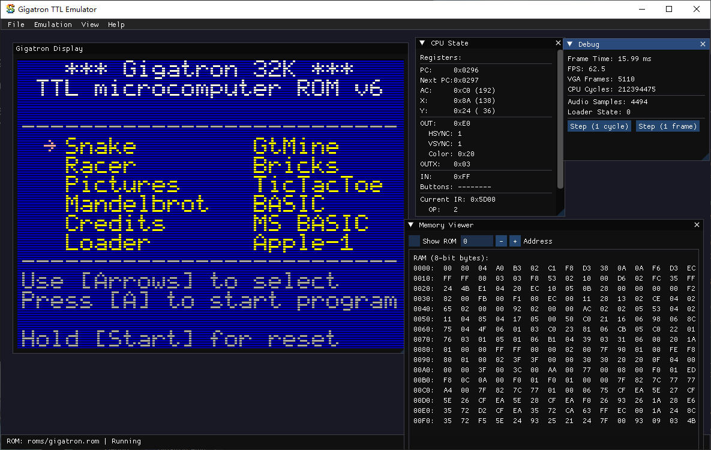
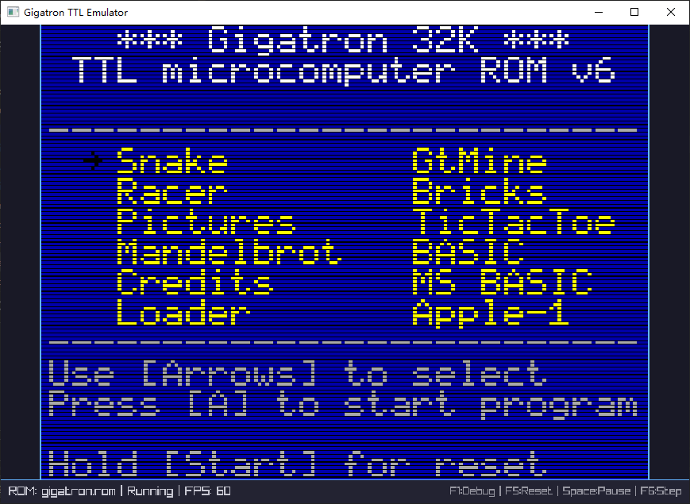

# Gigatron TTL Microcomputer Emulator


sokol demo


raylib demo

A cross-platform emulator for the [Gigatron TTL microcomputer](https://gigatron.io/), implemented in C with a sokol + Dear ImGui frontend.

Based on https://github.com/PhilThomas/gigatron.
You can [try it online](https://gigatron.io/emu/).

You can find roms & apps at https://github.com/kervinck/gigatron-rom/

## Features

- **Pure C emulator core** - Clean, portable implementation of the Gigatron CPU, VGA output, and audio
- **Cross-platform GUI** - Built with sokol and Dear ImGui, runs on Windows, macOS, and Linux
- **GT1 file loading** - Load and run GT1 programs
- **Debug tools** - CPU state viewer, memory viewer, step debugging
- **Audio emulation** - Real-time audio output via sokol_audio

## Usage

1. Launch the emulator: `./gigatron_emu`
2. Load a ROM file: `File > Open ROM...` (or drag & drop a .rom file)
3. Load GT1 programs: `File > Load GT1...` (or drag & drop a .gt1 file)

### Controls

| Key | Button |
|-----|--------|
| Arrow Keys / WASD | D-Pad |
| Z / J | A Button |
| X / K | B Button |
| Enter | Start |
| Escape / Backspace | Select |

### Keyboard Shortcuts

| Shortcut | Action |
|----------|--------|
| Ctrl+O | Open ROM |
| Ctrl+L | Load GT1 |
| F1 | Toggle Debug Window |
| F2 | Toggle CPU State |
| F3 | Toggle Memory Viewer |
| F5 | Reset Emulator |
| Space | Pause/Resume |

## Architecture

The emulator is structured in layers:

```
┌─────────────────────────────────────┐
│         Frontend (main.cpp)         │
│       sokol_app + Dear ImGui        │
├─────────────────────────────────────┤
│  VGA   │   Audio   │    Loader      │
│ vga.c  │  audio.c  │   loader.c     │
├─────────────────────────────────────┤
│         Gigatron Core               │
│           gigatron.c                │
└─────────────────────────────────────┘
```

### Core Components

- **gigatron.c/h** - CPU emulation (registers, instruction decoding, execution)
- **vga.c/h** - VGA signal generation and framebuffer rendering
- **audio.c/h** - Audio sample generation from OUTX register
- **loader.c/h** - GT1 file parser and loader

## Technical Details

### Gigatron Specifications

- **CPU Clock**: 6.25 MHz
- **ROM**: 64K x 16-bit (128KB)
- **RAM**: 32K x 8-bit (32KB)
- **Display**: 640x480 VGA (160x120 Gigatron pixels)
- **Audio**: 4-bit DAC via OUTX register
- **Input**: 8-bit active-low gamepad interface

### Instruction Format

```
15 14 13 | 12 11 10 | 9 8 | 7 6 5 4 3 2 1 0
   OP    |   MODE   | BUS |        D
```

- **OP** (3 bits): Operation (LD, AND, OR, XOR, ADD, SUB, ST, BR)
- **MODE** (3 bits): Addressing mode / destination register
- **BUS** (2 bits): Bus source (D, RAM, AC, IN)
- **D** (8 bits): Immediate data

## gigatron_core API

The `gigatron_core` library provides a pure C implementation that can be easily integrated into any frontend.

### Basic Usage

```c
#include "gigatron.h"
#include "vga.h"
#include "audio.h"
#include "loader.h"

int main() {
    /* Initialize CPU */
    gigatron_t cpu;
    gigatron_config_t config = gigatron_default_config();
    gigatron_init(&cpu, &config);
    
    /* Initialize peripherals */
    vga_t vga;
    audio_t audio;
    loader_t loader;
    
    vga_init(&vga, &cpu);
    audio_init(&audio, &cpu);
    loader_init(&loader, &cpu);
    
    /* Load ROM */
    gigatron_load_rom_file(&cpu, "roms/gigatron.rom");
    gigatron_reset(&cpu);
    
    /* Main loop - run at 60fps */
    while (running) {
        /* Update input (active low) */
        cpu.in_reg = button_state ^ 0xFF;
        
        /* Run one frame (~104166 cycles at 6.25MHz/60fps) */
        uint32_t cycles = cpu.hz / 60;
        for (uint32_t i = 0; i < cycles; i++) {
            gigatron_tick(&cpu);
            vga_tick(&vga);
            audio_tick(&audio);
        }
        
        /* Check for new frame */
        if (vga_frame_ready(&vga)) {
            /* vga.pixels contains RGBA framebuffer (640x480) */
            update_display(vga.pixels);
        }
        
        /* Read audio samples */
        float samples[1024];
        uint32_t count = audio_read_samples(&audio, samples, 1024);
        play_audio(samples, count);
    }
    
    /* Cleanup */
    loader_shutdown(&loader);
    audio_shutdown(&audio);
    vga_shutdown(&vga);
    gigatron_shutdown(&cpu);
    
    return 0;
}
```

### CPU API (gigatron.h)

```c
/* Configuration */
gigatron_config_t gigatron_default_config(void);

/* Lifecycle */
bool gigatron_init(gigatron_t* cpu, const gigatron_config_t* config);
void gigatron_shutdown(gigatron_t* cpu);
void gigatron_reset(gigatron_t* cpu);

/* Execution */
void gigatron_tick(gigatron_t* cpu);           /* Single cycle */
void gigatron_run(gigatron_t* cpu, uint32_t cycles);

/* ROM loading */
bool gigatron_load_rom_file(gigatron_t* cpu, const char* filename);
size_t gigatron_load_rom(gigatron_t* cpu, const uint8_t* data, size_t size);

/* I/O helpers */
void gigatron_set_input(gigatron_t* cpu, uint8_t value);
uint8_t gigatron_get_output(gigatron_t* cpu);
uint8_t gigatron_get_outx(gigatron_t* cpu);
bool gigatron_hsync_active(gigatron_t* cpu);
bool gigatron_vsync_active(gigatron_t* cpu);
uint8_t gigatron_get_color(gigatron_t* cpu);
```

### VGA API (vga.h)

```c
bool vga_init(vga_t* vga, gigatron_t* cpu);
void vga_shutdown(vga_t* vga);
void vga_reset(vga_t* vga);
void vga_tick(vga_t* vga);

/* Framebuffer access */
const uint8_t* vga_get_framebuffer(const vga_t* vga);  /* RGBA, 640x480 */
bool vga_frame_ready(vga_t* vga);                       /* Returns true once per frame */
uint32_t vga_get_frame_count(const vga_t* vga);

/* Color conversion helper */
void vga_color_to_rgba(uint8_t color, uint8_t* r, uint8_t* g, uint8_t* b);
```

### Audio API (audio.h)

```c
bool audio_init(audio_t* audio, gigatron_t* cpu);
void audio_shutdown(audio_t* audio);
void audio_reset(audio_t* audio);
void audio_tick(audio_t* audio);

/* Sample buffer */
uint32_t audio_read_samples(audio_t* audio, float* out, uint32_t count);
uint32_t audio_available_samples(const audio_t* audio);
bool audio_buffer_full(const audio_t* audio);

/* Volume control */
void audio_set_volume(audio_t* audio, float volume);  /* 0.0 - 1.0 */
void audio_set_mute(audio_t* audio, bool mute);
```

### GT1 Loader API (loader.h)

```c
bool loader_init(loader_t* loader, gigatron_t* cpu);
void loader_shutdown(loader_t* loader);
void loader_reset(loader_t* loader);

/* GT1 file handling */
gt1_file_t* loader_load_gt1_file(const char* filename);
gt1_file_t* loader_parse_gt1(const uint8_t* data, size_t size);
void loader_free_gt1(gt1_file_t* gt1);

/* Loading process */
bool loader_start(loader_t* loader, gt1_file_t* gt1);
void loader_tick(loader_t* loader);  /* Call every CPU cycle while active */

/* Status */
bool loader_is_active(const loader_t* loader);
bool loader_is_complete(const loader_t* loader);
bool loader_has_error(const loader_t* loader);
const char* loader_get_error(const loader_t* loader);
float loader_get_progress(const loader_t* loader);
```

### Important Notes

1. **Input Register**: The input is active-low. XOR with 0xFF to convert from active-high button states.

2. **Loader Timing**: When loading GT1 files, the loader controls `cpu.in_reg`. Don't update input manually while `loader_is_active()` returns true.

3. **Frame Timing**: Run approximately `cpu.hz / 60` cycles per frame for 60fps emulation.

4. **Color Format**: VGA output uses BBGGRR format (2 bits each). Use `vga_color_to_rgba()` for conversion.

## Resources

- [Gigatron Official Website](https://gigatron.io/)
- [Gigatron GitHub](https://github.com/kervinck/gigatron-rom)
- [Gigatron Forum](https://forum.gigatron.io/)

## License

MIT License - See LICENSE file for details.

## Credits

Based on the official Gigatron JavaScript emulator and documentation.
